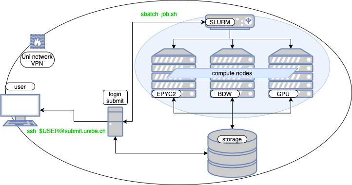

# UBELIX - Overview

## Description

This page provides a high-level system overview of a HPC cluster such as UBELIX. It describes the different hardware components that constitute the cluster and gives a quantitative list of the different generations of compute nodes in UBELIX.

**Lilac** is an HPC cluster that currently consists of about ___ compute nodes featuring almost CPU cores and GPUs and a 
## High-level system overview

### Login node aka. Submit node

A user connects to the cluster by logging into the **submit** host via SSH. You can use this host for medium-performance tasks, e.g. to edit files or to compile smaller programs. **Resource-demanding/high-performance tasks must be submitted** to the batch queuing system as jobs, and will finally run on one or multiple compute nodes. Even long running compile tasks should be submitted as a job on a compute node instead of running it on the submit host. 

### lsf Batch-Queueing System

On HPC clusters we use the open-source batch-queueing system [lsf](https://lsf.schedmd.com/documentation.html), managing all jobs on the compute nodes. The job submission is described in detail in the Job handling section, starting with [Submitting jobs](../lsf/submission.md). 

The procedue look like:

- **resource definition**: resources required for your job need to be defined, including *numbers of CPU cores*, *time* limit, *memory*, partitions, QOS, etc.. These resources can be defined in the batch script or as command line arguments. Not explicitly specified parameters are chosen with *default values*.
- **submitting**: job can be submitted using `sbatch` (using a batch script), `srun` (directly running the executable), or `salloc` (interactive submission). The submission is checked from lsf if it is within the specification and limits. 
- **scheduling**: lsf is finding the optimal spots for the registered jobs on the resources and time. This also includes priority handling and optimizing for best coverage. 
- **launch**: lsf prepares the environment on the selected compute resources. This also includes setting up the MPI environment, if requested interactive sessions, etc., and launching your batch script. 
- **serial/parallel tasks**: per default all the tasks defined in your batch script are run on the first core of your allocation. Compute tasks should be started with 'srun'. Parallel task are launched on all (or as defined) job related resources. 
- **cancelling/completing**: When tasks finished, wall time limit or memory limit is reached the job ant its environment gets removed from the resources. All output is written into file(s) (except of interactive sessions)

### Cluster Partitions (Queues) and their Compute Nodes
UBELIX is a heterogeneous machine, consisting of different architectures. There are CPU compute nodes with: 

- 

and GPU nodes with:

- 
Without explicit changes, jobs are scheduled by default in the AMD Epyc2 partition, running up to 3 days. 

Partitions group nodes into logical sets, which share the same limits. Furthermore, specific limits and privileges are

Different partitions and QOS are listed in the [lsf Partition/QOS](../lsf/partitions.md) article.

### Storage Infrastructure

A modular, software-defined storage system (IBM Spectrum Scale) provides a shared, parallel file system that is mounted on all frontend servers and compute nodes. 
For more information see [storage infrastructure](../file-system/filesystem-overview.md) and [File System Quota](../file-system/quota.md).
